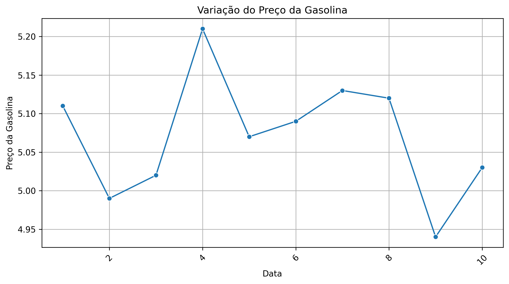

# preco-gasolina
Este repositório contém um projeto de análise do preço médio da gasolina na cidade de São Paulo nos 10 primeiros dias de julho de 2021.

## Arquivos
- `gasolina.csv`: Base de dados com os preços da gasolina.
- `gasolina.py`: Código em Python para gerar o gráfico.
- `gasolina.png`: Gráfico gerado a partir dos dados.

## Como Executar

1. Instale as dependências necessárias:
   ```bash
   pip install pandas seaborn matplotlib

   python gasolina.py


### Comandos Git para adicionar, commitar e enviar as alterações:

```bash
# Criar ou editar o arquivo README.md
nano README.md  # (ou use um editor de sua escolha)

# Adicionar o arquivo README.md ao Git
git add README.md

# Criar um commit com uma mensagem descritiva
git commit -m "Adiciona README.md com descrição do repositório"

# Enviar as alterações para o repositório remoto no GitHub
git push origin main

### Resultado

O script gera o seguinte gráfico de variação do preço da gasolina ao longo do tempo:


